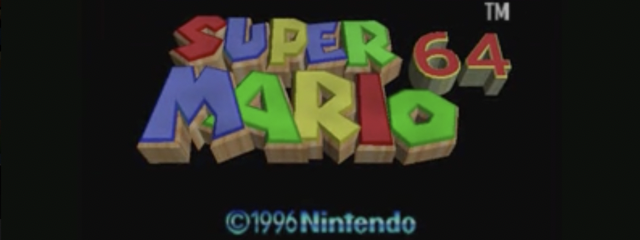
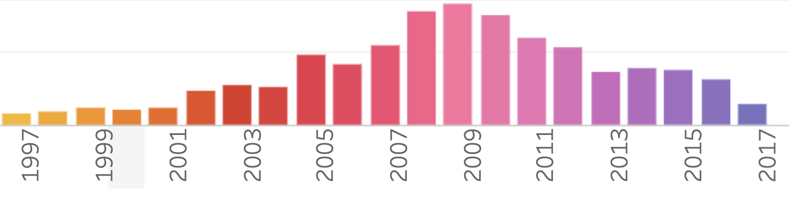

## Proyecto visualización en Tableau

Para este proyecto utilicé un archivo CSV sobre las ventas de los videojuegos desde 1980 a 2017

El mismo fue extraído de [Kaggle](https://www.kaggle.com/datasets/gregorut/videogamesales), transformado, y  cargado en una base de datos en DBeaver.

Posteriormente, con la herramienta [Tableau](https://www.tableau.com/es-es/community/public) realicé los gráficos y dashboards correspondientes.

## 📌 Estructura del Repositorio

El repositorio se divide en las siguientes carpetas y archivos:

* 📂 **Data**: Contiene el dataset, tanto en crudo como limpio.
* **📔 Notebook**: Contiene el procedicimiento de exploración, análisis y limpieza del dataset.
* **📷 Imágenes:** Contiene las imágenes utilizadas

# 🎮 *Historia de la Evolución de la Industria de Videojuegos* 🎮

Hace más de cuatro décadas, la industria de los videojuegos comenzó su ascenso, transformando la forma en que las personas se entretenían y conectaban con la tecnología. La historia que voy a compartir con ustedes se sumerge en los datos de ventas de videojuegos, explorando hitos tecnológicos, innovaciones de mercado y tendencias socioculturales que han dado forma a este fenómeno global.

#### ➡️ 1980-1995: Los Primeros Pasos y la Era de las Consolas 8-bits

En los albores de los videojuegos, títulos clásicos como "Super Mario Bros" en la NES marcaron el comienzo de una nueva era. La década de 1980 vio el auge de las consolas de 8 bits, estableciendo los cimientos de la industria. Pero fue recién en 1996 cuando un cambio significativo ocurrió: la introducción de la Nintendo 64 y el surgimiento de juegos en 3D como "Super Mario 64". Este hito tecnológico atrajo a más jugadores y marcó el inicio de una era dorada. En este año se ve un  aumento significativo en las ventas a nivel global

#### ➡️ 1996-2008: Innovaciones y Explosión de Ventas

En 1996, la Nintendo 64 y la PlayStation de Sony llevaron los gráficos a un nuevo nivel, y la popularidad de los juegos en 3D impulsó las ventas a nivel global. El año 2001 trajo la Xbox de Microsoft y el lanzamiento de la Game Boy Advance, expandiendo aún más el mercado. Aparecieron las pantallas LED, mejorando la experiencia de juego. Es así que desde 1996 las ventas no dejaron de aumentar

El boom alcanzó su punto máximo en 2008, impulsado por la PlayStation 2, la Wii y la Xbox 360. La innovación en hardware, junto con títulos icónicos como "Wii Sports", catapulta las ventas a niveles sin precedentes. Sin embargo, este pico también coincidió con la crisis financiera global...

#### ➡️ 2008-Actualidad: Cambios en el Modelo de Negocio y la Era de la Conectividad

La crisis financiera de 2008 afectó la industria, pero fue solo el comienzo de una transformación más profunda. La llegada de los smartphones permitió el auge de los juegos móviles, alterando el panorama. El cambio en el modelo de negocio hacia juegos gratuitos con compras integradas cambió la forma en que los consumidores gastaban.

A medida que avanzamos hacia la actualidad, observamos un descenso en las ventas tradicionales de videojuegos. La saturación del mercado, la competencia con otras formas de entretenimiento y la rápida evolución de la tecnología han contribuido a este declive.

## Conclusiones: Un Viaje a Través de las Décadas

En resumen, nuestro viaje a través de las décadas de la industria de videojuegos revela una narrativa de innovación, expansión global y cambios en los patrones de consumo. Desde los primeros días de Super Mario hasta el apogeo de la Wii y la PlayStation 2, la industria ha vivido una montaña rusa de éxitos y desafíos.

##### 👀 Para ilustrar lo anteriormente relatado diseñé el siguiente DashBoard en [Tableau Public](https://public.tableau.com/app/profile/yanina.fontana/viz/Games_17010257398630/DashboardGames)

#### Recursos utilizados 📚

* [Python](https://docs.python.org/3/library/functions.html) 🐍
* [Pandas](https://pandas.pydata.org/docs/) 🐼
* [SQLAlchemy](https://www.sqlalchemy.org/)
* [DBeaver](https://dbeaver.com/docs/dbeaver/) 🦫
* [Tableau Public](https://www.tableau.com/es-es/community/public) 📊
* [Kaggle](https://www.kaggle.com/datasets/gregorut/videogamesales) 👥

.
